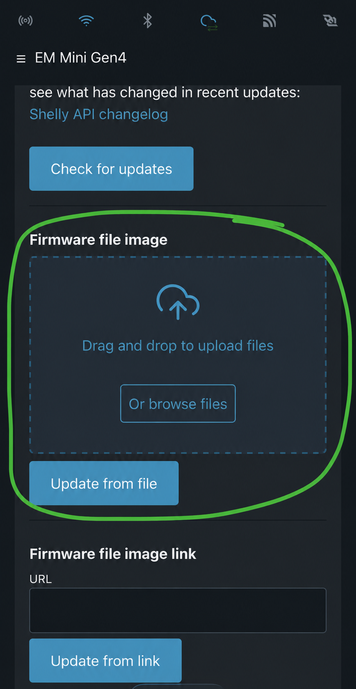
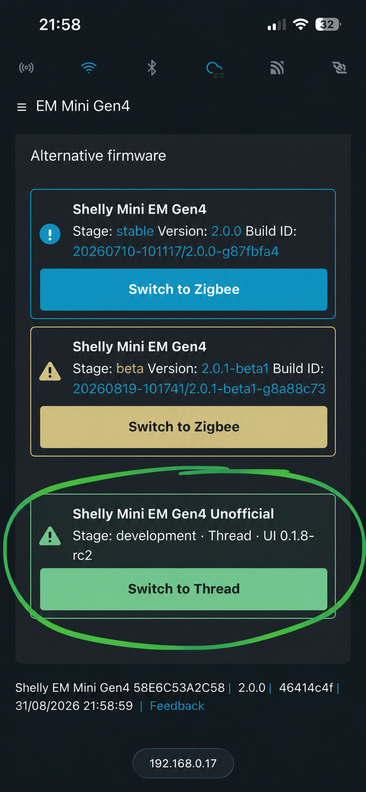
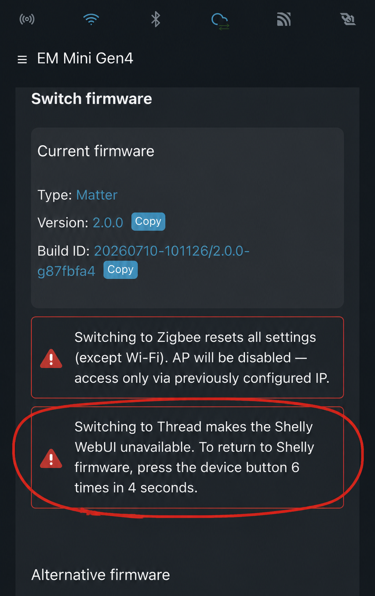

# Shelly EM Mini Gen4 — Matter over Thread

Unofficial Matter-over-Thread firmware for the **Shelly EM Mini Gen4**. It keeps the original Shelly firmware available and adds a Matter Electrical Sensor exposing voltage, current, active power and imported/exported energy.

> [!WARNING]
> This is an unofficial beta project and is not affiliated with or supported by Shelly Group. Installing custom firmware carries a risk of device failure or data loss. The device is mains powered: never open or connect a UART adapter while it is connected to mains voltage.

## v1.0.0 beta

The first public beta includes:

- Matter over Thread energy measurements;
- the original Shelly firmware in the alternative application slot;
- switching from the Shelly WebUI to Thread;
- six quick button presses to return to Shelly firmware;
- private Thread storage without overwriting Shelly factory data;
- LED status and Matter Identify support.

[Download v1.0.0 beta](https://github.com/Handy-Harry/shelly-em-mini-gen4-thread/releases/tag/v1.0.0)

## Requirements

- Shelly EM Mini Gen4, model `S4EM-001PXCEU16`;
- stock Shelly firmware/WebUI version `2.0.0`;
- a working Thread Border Router;
- a Matter controller such as Home Assistant;
- authentication disabled temporarily during installation, where required by the stock WebUI.

Do not install this package on a different Shelly model or hardware revision.

## Installation

1. Download `shelly-unofficial-em-mini-gen4-v1.0.0-dual-webui.zip` from the GitHub Release.
2. Open the Shelly WebUI.
3. Go to **Settings → Firmware → Firmware file image**.
4. Select the downloaded zip and wait for the update to finish. Do not interrupt power.
5. After the Shelly WebUI returns, open **Settings → Firmware** and select **Switch to Thread**.
6. Commission the device with your Matter controller using the QR or manual code shown in the Matter page.

Do **not** use the stock **Switch to alternative firmware** Zigbee action to install this package.

## Return to Shelly firmware

Press the physical device button **six times quickly**. The device saves its Thread state and returns to the Shelly firmware. The Shelly WebUI then becomes available again at its configured IP address.

## Matter naming

The firmware exposes `Shelly EM Mini Gen4` as its Matter `NodeLabel`. Some Matter controllers still propose the generic name `Matter Accessory` during commissioning. You can safely replace that proposed name with `Shelly EM Mini Gen4` in the controller.

## Security note

The beta firmware uses shared development commissioning credentials. If several uncommissioned devices run this firmware, power and commission only one at a time. After commissioning, the device receives its own operational identity in your Matter fabric.

## Verification

The release process checks the ESP image, partition geometry, embedded WebUI identities, RC2-to-v1.0.0 migration data, NVS behavior, LED/Identify behavior, fault recovery and OTA contents. Checksums and the machine-readable report are stored under [`releases/v1.0.0`](releases/v1.0.0/).

The warm switch from Shelly firmware to Thread and the LED behavior were also confirmed on the project device.

## Licensing and attribution

This project is based on work by AUTOMATOUS.IO and the ESP-Matter, Matter/connectedhomeip, OpenThread and ESP-IDF projects. See [LICENSE](LICENSE) and [NOTICE](NOTICE). Shelly names and trademarks belong to their respective owner; their use here only identifies compatible hardware.
